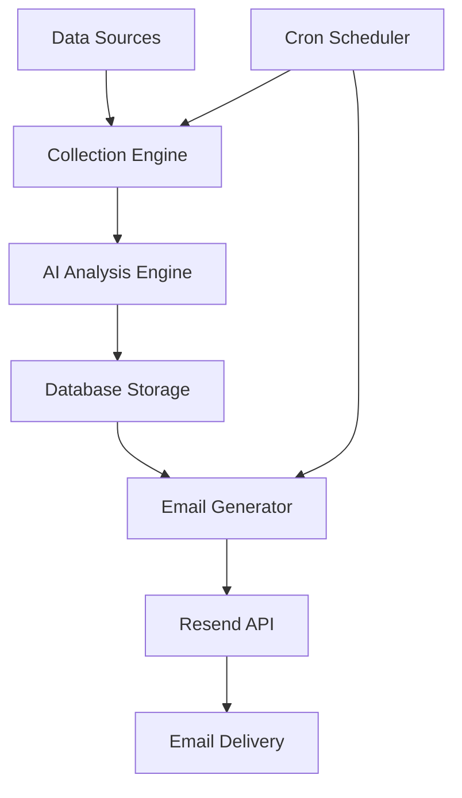

# HelixAdvisors.AI Automation System

🤖 **Comprehensive guide to the automated intelligence and email reporting system**

## 🎯 Automation Overview

The HelixAdvisors.AI platform includes a sophisticated automation system that:

- **Analyzes market data twice daily** (8 AM & 8 PM)
- **Generates intelligent reports** with actual startup ideas
- **Sends professional email briefings** with actionable insights
- **Continuously monitors** multiple data sources
- **Scores and ranks ideas** using advanced AI algorithms

## ⏰ Automated Schedule

### Daily Intelligence Cycle

| Time | Process | Description |
|------|---------|-------------|
| **6:00 AM** | Data Collection | Multi-source data gathering begins |
| **7:00 AM** | AI Analysis | Idea processing and scoring |
| **8:00 AM** | Morning Report | **📧 Morning Intelligence Brief** |
| **6:00 PM** | Evening Analysis | Market update processing |
| **8:00 PM** | Evening Report | **📧 Evening Market Update** |

## 📧 Email Reports

### Morning Intelligence Brief (8:00 AM)

**Content Includes:**
- 📊 **Key metrics** from last 24 hours
- 🆕 **Latest startup ideas** with AI scoring
- 🔥 **Trending opportunities** from last 48 hours
- ⚡ **Quick action links** to dashboard

**Sample Metrics:**
- New ideas discovered
- Average AI score
- Top-performing idea score
- Market trend indicators

### Evening Market Update (8:00 PM)

**Content Includes:**
- 📈 **Market analysis** throughout the day
- 🎯 **Top-scored ideas** from recent analysis
- 📊 **Performance insights** and trends
- 🔍 **Opportunities** for further research

## 🔧 System Architecture

### Edge Functions (Supabase)

1. **daily-email-reports-cron**
   ```typescript
   // Handles both morning and evening reports
   // Fetches latest ideas from database
   // Generates HTML email templates
   // Sends via Resend API
   ```

2. **multi-source-intelligence-engine**
   ```typescript
   // Collects data from multiple sources
   // Processes and analyzes content
   // Stores in startup_ideas table
   ```

3. **ai-analysis-engine**
   ```typescript
   // Scores ideas using AI algorithms
   // Updates total_score and analysis fields
   // Triggers trend detection
   ```

### Cron Jobs (PostgreSQL)

```sql
-- Morning email (8:00 AM UTC)
SELECT cron.schedule('morning-email', '0 8 * * *', 
  'CALL daily_email_reports_cron()');

-- Evening email (8:00 PM UTC)
SELECT cron.schedule('evening-email', '0 20 * * *', 
  'CALL daily_email_reports_cron()');

-- Data collection (6:00 AM UTC)
SELECT cron.schedule('data-collection', '0 6 * * *', 
  'CALL multi_source_intelligence_cron()');
```

## 📊 Data Flow



### Data Sources

- **Market APIs** - Real-time market data
- **News Feeds** - Industry news and trends
- **Social Media** - Trending topics and discussions
- **Patent Databases** - Innovation tracking
- **Investment Platforms** - Funding trends

### Processing Pipeline

1. **Collection** → Raw data gathering
2. **Filtering** → Relevance scoring
3. **Analysis** → AI-powered evaluation
4. **Scoring** → Multi-factor ranking
5. **Storage** → Database persistence
6. **Reporting** → Email generation

## 🎨 Email Templates

### Template Structure

```html
<!-- Professional HTML email template -->
<div style="max-width: 600px; margin: 0 auto;">
  <!-- Header with branding -->
  <header style="background: linear-gradient(...)">
    <h1>HelixAdvisors.AI</h1>
    <p>Morning Intelligence Brief</p>
  </header>
  
  <!-- Key insights dashboard -->
  <section class="insights">
    <div class="metric">New Ideas: 15</div>
    <div class="metric">Avg Score: 7.8</div>
    <div class="metric">Top Score: 9.2</div>
  </section>
  
  <!-- Ideas table -->
  <section class="ideas">
    <table><!-- Formatted ideas list --></table>
  </section>
  
  <!-- Action buttons -->
  <section class="actions">
    <a href="/dashboard">View Dashboard</a>
    <a href="/ideas">Browse Ideas</a>
  </section>
</div>
```

### Responsive Design

- **Mobile-optimized** layouts
- **Dark/light mode** compatible
- **Accessible** color schemes
- **Professional** typography

## ⚙️ Configuration

### Environment Variables

```env
# Required for automation
RESEND_API_KEY=re_your_key_here
SUPABASE_URL=https://your-project.supabase.co
SUPABASE_SERVICE_ROLE_KEY=your_service_key

# Optional customization
EMAIL_FROM_NAME="HelixAdvisors.AI Intelligence"
EMAIL_RECIPIENT=alessandro@carism.it
REPORT_TIMEZONE=UTC
```

### Database Tables

```sql
-- Email logs tracking
CREATE TABLE email_logs (
  id SERIAL PRIMARY KEY,
  recipient_email VARCHAR(255),
  email_type VARCHAR(100),
  ideas_count INTEGER,
  avg_score DECIMAL(3,1),
  sent_at TIMESTAMP,
  email_id VARCHAR(255)
);

-- Startup ideas with AI scoring
CREATE TABLE startup_ideas (
  id SERIAL PRIMARY KEY,
  idea_name VARCHAR(255),
  description TEXT,
  total_score DECIMAL(3,1),
  created_at TIMESTAMP,
  -- ... additional scoring fields
);
```

## 🔍 Monitoring & Analytics

### Email Performance

- **Delivery rates** - Success/failure tracking
- **Open rates** - Engagement monitoring
- **Click-through rates** - Action tracking
- **Bounce rates** - List health

### System Health

- **Function execution** - Success/failure logs
- **Database performance** - Query execution times
- **API rate limits** - Usage monitoring
- **Error tracking** - Automated alerts

### Business Metrics

- **Ideas discovered** - Daily discovery rate
- **Score distribution** - Quality trending
- **User engagement** - Dashboard activity
- **Feature usage** - Most accessed sections

## 🛠️ Customization

### Changing Email Schedule

```sql
-- Update cron expressions
SELECT cron.alter_job(job_id, schedule := '0 9 * * *');

-- Add additional schedules
SELECT cron.schedule('midday-update', '0 12 * * *', 
  'CALL daily_email_reports_cron()');
```

### Modifying Email Content

```typescript
// In daily-email-reports-cron function
const emailContent = {
  subject: `🚀 Custom Subject - ${currentDate}`,
  html: generateCustomTemplate({
    ideas: newIdeas,
    insights: calculatedInsights,
    branding: customBranding
  })
};
```

### Adding Data Sources

```typescript
// Extend multi-source-intelligence-engine
const dataSources = [
  { name: 'existing-source', endpoint: '...' },
  { name: 'new-source', endpoint: 'https://api.new-source.com' }
];
```

## 🔧 Troubleshooting

### Common Issues

1. **Emails Not Sending**
   ```bash
   # Check Resend API key
   # Verify recipient email
   # Check Edge Function logs
   ```

2. **Cron Jobs Not Running**
   ```sql
   -- Check active jobs
   SELECT * FROM cron.job;
   
   -- Check job execution history
   SELECT * FROM cron.job_run_details;
   ```

3. **Missing Data**
   ```bash
   # Verify data collection functions
   # Check API rate limits
   # Review error logs
   ```

### Debug Mode

Enable detailed logging:

```typescript
const DEBUG = Deno.env.get('DEBUG') === 'true';

if (DEBUG) {
  console.log('Detailed execution info...');
}
```

## 📈 Performance Optimization

### Database Optimization

```sql
-- Index for faster queries
CREATE INDEX idx_ideas_score_date 
ON startup_ideas(total_score DESC, created_at DESC);

-- Cleanup old data
DELETE FROM email_logs 
WHERE sent_at < NOW() - INTERVAL '90 days';
```

### Email Optimization

- **Template caching** - Reduce generation time
- **Batch processing** - Handle multiple recipients
- **Retry logic** - Handle delivery failures
- **Rate limiting** - Respect API limits

## 🚀 Advanced Features

### A/B Testing

```typescript
// Test different subject lines
const subjectVariations = [
  '🚀 Morning Brief',
  '📊 Intelligence Update',
  '🎯 Market Insights'
];

const selectedSubject = getABTestVariation(recipient);
```

### Personalization

```typescript
// Customize based on user preferences
const personalizedContent = {
  industries: user.preferred_industries,
  scoring_weights: user.custom_weights,
  format: user.email_format
};
```

### Smart Filtering

```typescript
// Only include relevant ideas
const filteredIdeas = allIdeas.filter(idea => 
  idea.total_score >= user.minimum_score &&
  idea.industry.some(i => user.interests.includes(i))
);
```

## 📞 Support

For automation-related issues:

1. **Check system status** - Supabase dashboard
2. **Review logs** - Edge Function execution logs  
3. **Test manually** - Trigger functions directly
4. **Contact support** - support@helixadvisors.ai

---

**The automation system ensures you never miss important market opportunities with twice-daily intelligent briefings delivered directly to your inbox.**
